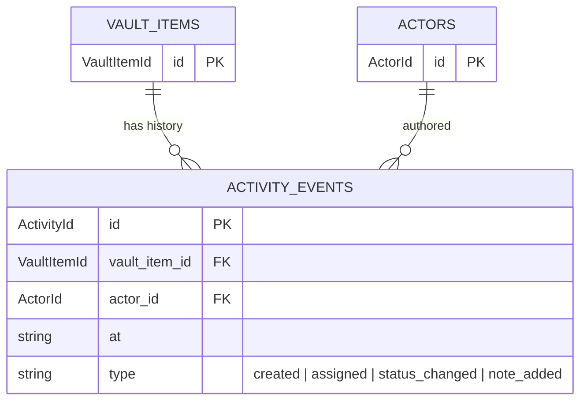

# Activity

> Append-only log of what happened to a vault item, and who did it.

## What's here

- `activity-event.ts` — discriminated union of event types

## The shape

Every event has four fields in common:

| field | type | purpose |
|---|---|---|
| `id` | `ActivityId` (UUID) | durable identity |
| `vault_item_id` | `VaultItemId` (FK) | the item this event is about |
| `actor_id` | `ActorId` (FK) | who did it |
| `at` | ISO string | when |

Beyond that, the `type` discriminator narrows the payload.

## MVP event types

Four. Each earns its place by representing a moment the operator or an agent would want to see in a timeline.

| type | payload | what it means |
|---|---|---|
| `created` | — | this item came into existence |
| `assigned` | `from_actor_id`, `to_actor_id`, `reason` | ownership moved (handoff between actors, core ceremony) |
| `status_changed` | `from_status`, `to_status`, `note` | lifecycle step (`active → done → archived`) |
| `thread_message_posted` | `message_id`, `message_kind` | a conversational message landed — content lives in `thread_messages.body`, event is a pointer |

Adding a fifth type is a new string literal in the union — not a schema migration. Future candidates: `skill_invoked`, `priority_scored`, `grooming_status_changed`.

## Rationale

**Why discriminated union over one fat row with nullable columns?**
Because `status_changed` and `thread_message_posted` have nothing structurally in common beyond the base fields. Forcing them into a shared row means several null columns on every event and a runtime cast to read the payload. The union makes the narrowing free.

**Why `thread_message_posted` instead of `note_added`?**
Factual events and conversational content are different species (see `domain/thread/README.md`). The old `note_added` conflated them — a `body` string on a structural event row meant queries couldn't cleanly distinguish "who did what" from "who said what". The new shape points at a `ThreadMessage` row for content; the event stays structural.

**Why no `skill_id` on the base event at MVP?**
Skills are now first-class (`domain/skills/`). A dedicated `skill_invoked` event will be added once dispatching actually runs skills through an observable path. `skill_id: SkillId | null` as a base-event field was considered and deferred — not every event has a skill; adding it as optional dilutes the types.

**Why no field-level diff log?**
We discussed and killed it (whiteboard K2). A firehose of `{field, old, new}` rows is forensic plumbing, not a ceremony log. The operator wants to see *"boris handed back to marvin for AC review"*, not *"column `assigned_to` changed from 'boris' to 'marvin'"*.

## Relationships

The event table is **append-only**. Corrections happen by writing new events, not by editing old ones.
