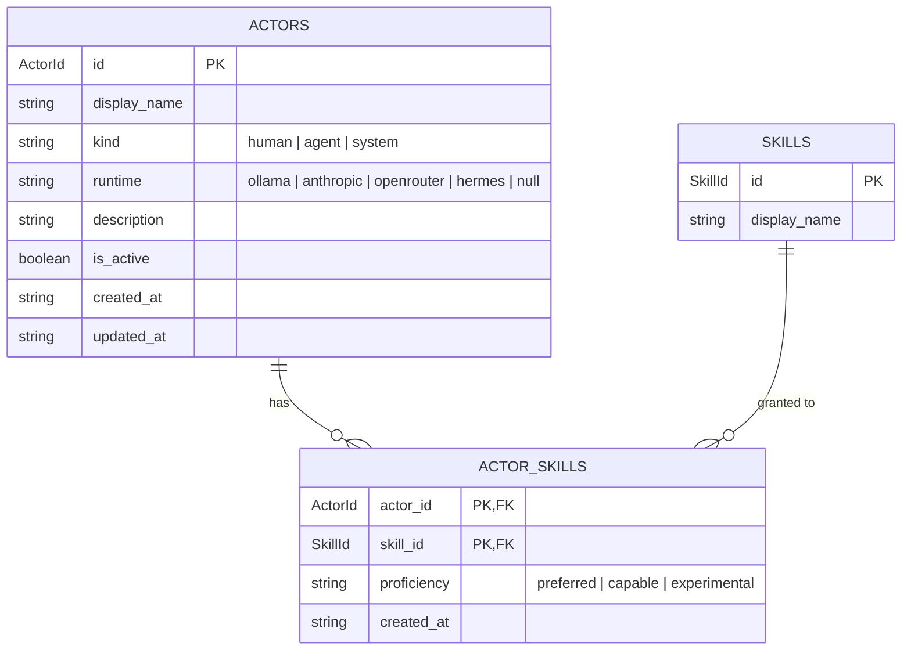

# Actors

> Who (or what) can take an action on a vault item.

## What's here

- `actor.ts` — the `Actor` shape
- `actor-skill.ts` — the `ActorSkill` junction (which skills each actor can run)
- `fixtures.ts` — hand-written sample data used to stress-test the shapes

## What an actor is

An actor is an identity. Humans, agents, and the orchestrator itself all live in the same table so every FK that says "this was done by X" can point at a single place.

Current roster (illustrative):

| id       | kind         | runtime    | description                                                                 |
|----------|--------------|------------|-----------------------------------------------------------------------------|
| `marvin` | human        | `null`     | the operator                                                                |
| `ralph`  | agent        | `ollama`   | local 7B-class model on 24GB RAM. Classification, reassigns, AC drafts      |
| `boris`  | agent        | `anthropic`| VPS-hosted loop, polls every 5 min, picks its own Sonnet-class model        |
| `jimbo`  | agent        | `hermes`   | hermes orchestrator. Telegram-facing. Coordinates the ceremony              |

## What an actor is *not*

- **Not live status.** Whether ralph is online, how many tasks boris has in flight, when jimbo last responded — that's operational state, lives in a `dispatch_runs` / `actor_status` projection, not on this row.
- **Not a model.** Boris is not "Sonnet 4.6". Boris is the chassis; the model it picks at runtime is recorded on the *activity event*, not on the actor.
- **Not capabilities on the row itself.** What skills an actor can run is the `actor_skills` junction. An actor row says who they are; the junction says what they're trusted to do.

## Shape rationale

Kept deliberately thin. Fields that got considered and dropped:

- `availability` (`always_on` / `sometimes_on` / `on_demand`) — conflates intent with live status. Ralph's availability at 3am depends on whether the laptop is open, not on a column value. Put this in a status projection if it earns its keep.
- `cost_tier` (`free` / `paid`) — cost is a property of the model used for a specific run, recorded on the activity event. Duplicating it here would drift.
- `capabilities_summary` — a future `actor_skills` junction will carry this as structured data. The `description` field handles the human-readable version in the meantime.

Every field here passes the test: *does a future row reference this actor by ID care about it?* If yes, it stays. If no, it moves.

## ERD

`SKILLS` is stubbed here — the canonical shape still lives in `src/app/features/skills/utils/skill.types.ts` and is scheduled for a pass-through into `domain/skills/` once it's extended with prompt/model/schema wiring.

### Routing with `proficiency`

`proficiency` is a routing weight, not a hard gate. When Jimbo needs an actor for skill `X`:

1. Pick from actors where `(actor_id, X)` exists with `proficiency = 'preferred'`.
2. If none are available, fall back to `'capable'`.
3. `'experimental'` is only picked when the operator explicitly opts in (or the higher tiers are exhausted and the work is not time-critical). Outcomes on experimental runs inform whether to promote the actor to `'capable'`.

No row for a given `(actor, skill)` pair = not eligible. Absence is meaningful.

## Open questions

Tracked on [`docs/architecture/whiteboard.md`](../../../../docs/architecture/whiteboard.md) — look for Q1–Q4 in the "Open design questions" section.
