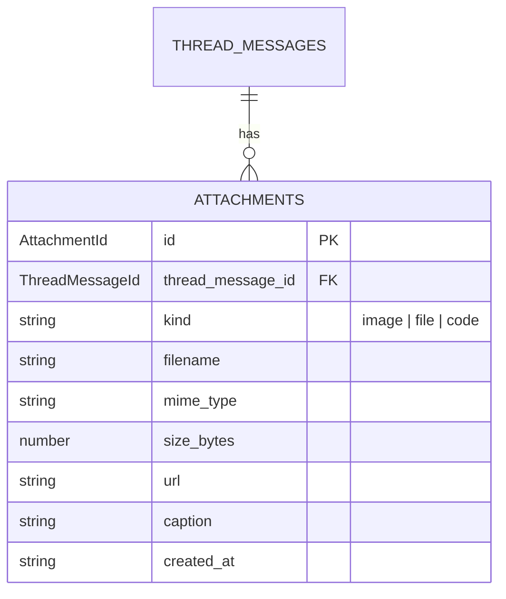

# Attachments

> Binary content attached to thread messages.

## What's here

- `attachment.ts` — the `Attachment` shape + `AttachmentKind` union

## Why attach to ThreadMessage, not VaultItem?

A single home avoids polymorphic host columns (`host_kind, host_id` gets awkward fast). VaultItem-level "attachments" are thread messages posted at creation — the intake message is a comment with attachments; the vault item itself just has a thread.

Downstream, queries like "show me all screenshots for #1892" become `SELECT * FROM attachments JOIN thread_messages ON ... WHERE vault_item_id = '1892'` — a single JOIN, no polymorphism.

## The shape

| field | type | purpose |
|---|---|---|
| `id` | `AttachmentId` (UUID) | durable handle |
| `thread_message_id` | `ThreadMessageId` (FK) | which message this belongs to |
| `kind` | `'image' \| 'file' \| 'code'` | drives UI rendering |
| `filename` | `string` | original filename for download |
| `mime_type` | `string` | precise content type |
| `size_bytes` | `number` | for display + upload limits |
| `url` | `string` | where the bytes live (blob store / CDN / local) |
| `caption` | `string \| null` | optional human-written context |
| `created_at` | ISO string | |

Byte storage is not this type's concern — jimbo-api chooses the blob mechanism. The type holds the URL pointer.

## Use cases

1. **Operator drags an image into thread.** Browser uploads via jimbo-api, gets a URL, POSTs an Attachment record linked to the message being composed.
2. **Agent captures a screenshot via Playwright.** Agent uploads to jimbo-api and attaches to a thread message it posts ("here's the current state of the build").
3. **External artefact references.** Operator pastes a GitHub PR link — that's a URL in the message body, NOT an attachment. Attachments are for bytes we host; external references stay inline prose.

## Agent consumption

Anthropic and OpenAI APIs accept images directly (base64 or URL). When agents consume a thread as context, the `image` attachments on messages can be passed to the model alongside text. Dashboard stores the URL; the model receives the image.

## What's NOT here (deferred)

- **Alt text / accessibility metadata** — `caption` covers the common case
- **Versioning / replace-in-place** — new attachment = new row; no edit semantics
- **Transcription for videos** — no video kind yet
- **Access control** — single-operator tool, all-or-nothing

## Relationship

