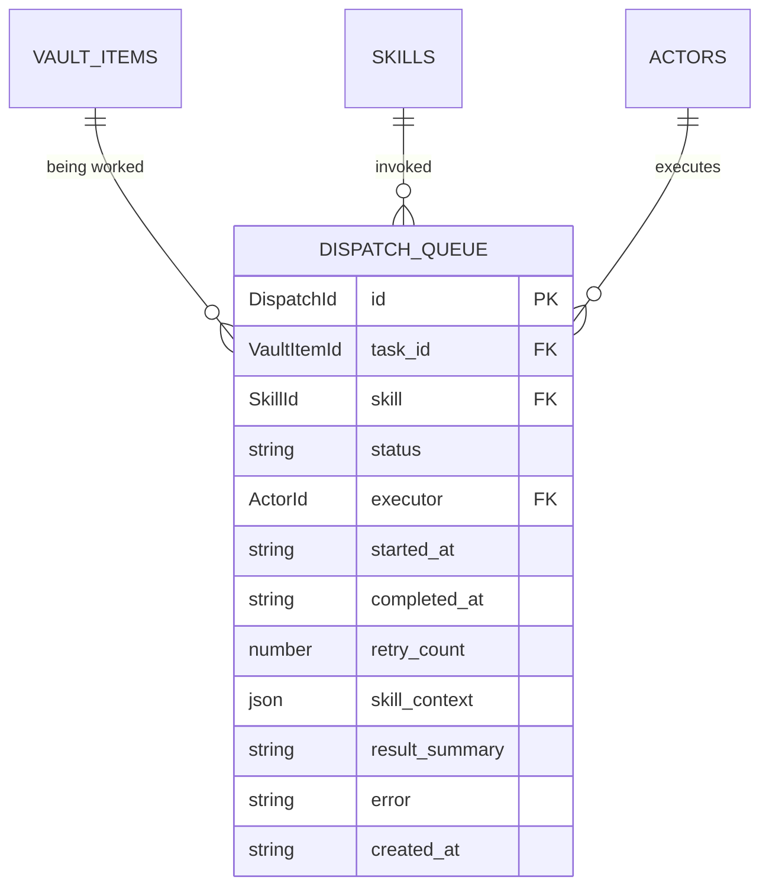

# Dispatch

> The ephemeral record of a skill running on a vault item.

## What's here

- `dispatch-queue-entry.ts` — `DispatchQueueEntry` shape + `DispatchStatus` lifecycle

## Why this entity exists

When a skill runs on a vault item, that run has a lifecycle: queued, claimed, executing, finished (or failed). That lifecycle is ephemeral — it doesn't belong on the vault item row (which tracks stable grooming position), and it doesn't belong on activity events (which are facts, not work-in-progress state).

The dispatch queue is the standard shape in systems with async workers: each row represents a unit of work waiting for or being processed by a worker. `commission-worker`, `vault-analyse`, and `vault-decompose` (hermes skills) all poll this queue for their next job.

## Fields

| field | type | purpose |
|---|---|---|
| `id` | `DispatchId` (UUID) | durable handle |
| `task_id` | `VaultItemId` (FK) | which vault item this dispatch is about |
| `skill` | `SkillId` (FK) | which skill to run (e.g. `hermes/intake-quality`) |
| `status` | `'approved' \| 'dispatching' \| 'running' \| 'completed' \| 'failed'` | lifecycle |
| `executor` | `ActorId` (FK) | who runs it (boris, ralph, etc.) |
| `started_at` | ISO \| null | when the executor claimed it |
| `completed_at` | ISO \| null | when it finished |
| `retry_count` | number | reaper tracks this on timeouts |
| `skill_context` | jsonb | skill-specific input payload |
| `result_summary` | string \| null | one-line outcome on success |
| `error` | string \| null | error message on failure |
| `created_at` | ISO | when enqueued |

## Lifecycle

```
      ┌──────────┐
      │ approved │  created by pipeline-pump cron
      └────┬─────┘
           │ dispatch-next poll picks it up
           ▼
     ┌──────────────┐
     │ dispatching  │  claim in-flight (brief)
     └─────┬────────┘
           │ dispatch-start
           ▼
       ┌─────────┐
       │ running │  executor is working
       └────┬────┘
            │
     ┌──────┴──────┐
     │             │
     ▼             ▼
┌───────────┐  ┌────────┐
│ completed │  │ failed │
└───────────┘  └────────┘
```

## Relationship to other entities

- **VaultItem** — a dispatch is always `task_id` → VaultItem. The item's `grooming_status` tracks stable position; the dispatch tracks the current work.
- **Skill** — `skill` is an FK; the dispatch is the runtime invocation of a Skill definition.
- **Actor** — `executor` is which actor runs it. Maps to actor_skills junction (the actor must have the skill granted).
- **ActivityEvent** — NOT written per dispatch. Dispatch completion may spawn activity events (e.g. `status_changed` when the skill updates the vault item), but the dispatch row itself isn't an activity.

## What's NOT here (deferred)

- **Activity event bridging** — a future `skill_invoked` event on the activity stream would reference a dispatch. Deferred until we actually want to show dispatches in the stream surface.
- **Cost / token tracking** per dispatch — deferred (whiteboard row 23).
- **Multi-skill workflows** (chained dispatches) — each dispatch is atomic; chains are emergent from pipeline-pump enqueueing the next skill when the previous completes.

## ERD



## Why the dashboard mostly reads, doesn't write

Hermes's `pipeline-pump` cron owns enqueueing. It reads `activity_events` (or polls vault items), decides what skills need to run, and inserts `approved` rows. Dashboard just observes — shows operator "vault-classify is running on @boris for 14m".

The exception: operator-triggered retry of a failed dispatch — rare but useful when hermes gives up on a bad state. Dashboard POSTs an `approved` row to re-queue the same work. `EnqueueDispatchPayload` is the shape.

All other lifecycle transitions (`approved → running`, `running → completed`, etc.) happen inside hermes skills and are not dashboard concerns.
