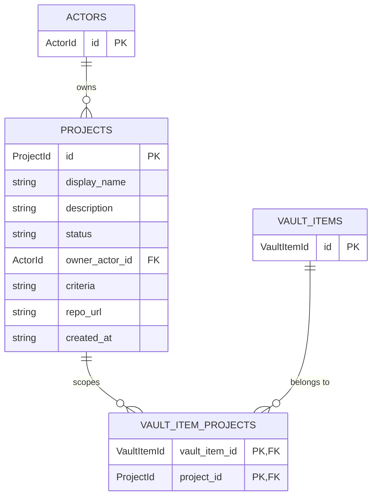

# Projects

> Long-lived context that vault items belong to — and the canonical home for domain criteria.

## What's here

- `project.ts` — the `Project` shape

## What a project is

A project groups work and carries the **rules that make the work meaningful**. Without a project, an item like *"Evaluate creativehertfordshire.com as a LocalShout event source"* has no addressable answer to the question *"what qualifies as a LocalShout event?"*. That answer lives on the project.

Concrete examples:

| id              | display_name    | what its criteria holds                                                 |
|-----------------|-----------------|-------------------------------------------------------------------------|
| `localshout`    | LocalShout      | what makes a venue/event qualify; target audiences; coverage regions    |
| `jimbo-hermes`  | Jimbo / Hermes  | orchestrator design principles; what micro-skills should and shouldn't do |
| `nz-passport`   | NZ Passport     | checklist of required documents and deadlines                            |

## The fields

| field | type | why it's here |
|---|---|---|
| `id` | `ProjectId` (slug) | short human handle, appears in URLs and ceremony logs |
| `display_name` | `string` | what the operator sees in lists |
| `description` | `string \| null` | one-liner for list views |
| `status` | `'active' \| 'archived'` | two states. Archive = hide. "Paused" projects stay active — low activity is self-evident from item counts |
| `owner_actor_id` | `ActorId` | who initiated the project. Default marvin; supports jimbo-owned prototypes without migration |
| `criteria` | `string \| null` | freeform markdown — domain rules agents can read when working on items in this project |
| `repo_url` | `string \| null` | where the project's code (and future project-scoped skills) live (P9). Null for lightweight/prototype projects |
| `created_at` | ISO string | |

Deliberately missing: `updated_at` (K6 — derive from events), structured sub-entities like goals/sources/scripts (deferred — row 18), project-level priority (overkill for a solo operator).

## Relationship to vault items

Many-to-many. An item can belong to multiple projects (cross-project work is a real case — a bug might affect LocalShout *and* SpoonsCount). Modelled as a junction (`domain/vault/vault-item-project.ts`) from the start to avoid an FK-to-junction migration later.

A vault item with **zero** project links is allowed (standalone). One or more is the common case.

Auto-linking via keyword match is deferred (whiteboard row 40).

## What's NOT here

- **Goals and Interests as sub-entities** (row 18). They aren't pipeline items and have different lifecycles. Covered by `tags` + `criteria` prose for MVP. Extracted to their own entities only when a concrete projection needs them.
- **Epics as project sub-entity.** Already modelled — `VaultItem.parent_id` does the job. `is_epic` is derived from having children.
- **Project priority.** Solo operator can eyeball 4–6 projects and pick what to do. Worth it when project count grows past ~10 or when jimbo needs to pick "which project to advance next".
- **Stakeholders / team / permissions.** Single-operator tool.
- **Activity events for projects.** Projects change rarely; when they do, we'll add project-level events. For now, creation is implicit.
- **Skills federation.** Row 38. Project can *own* skills via its `repo_url`, but the discovery layer isn't built.
