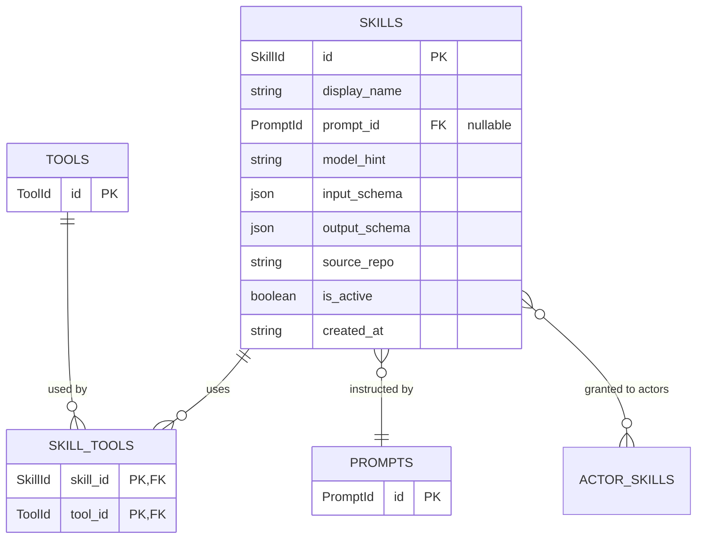

# Skills

> The unit the dispatcher picks when work needs doing.

## What's here

- `skill.ts` — the `Skill` shape + `ModelTier` union + `skillNamespace()` helper
- `skill-tool.ts` — the `SkillTool` junction (skills can use many tools, tools serve many skills)

## Why this entity exists

A skill is a named, dispatchable capability. When a vault item needs work done, the dispatcher looks up *which skill* to invoke and picks an actor capable of running it. This is the atomic unit the entire pipeline operates on.

Principle P1 (micro-skill decomposition): prefer many small skills over one big one. Each skill does one checkable thing with a clear input/output contract.

## The fields

| field | type | why it's here |
|---|---|---|
| `id` | `SkillId` (prefixed slug) | `{project-id}/{skill-name}`: `hermes/intake-quality`, `localshout/event-qualifier` |
| `display_name` | `string` | UI label |
| `description` | `string \| null` | what this skill does, human-readable |
| `prompt_id` | `PromptId \| null` | FK to the prompt. Null for pure-code skills (e.g. deterministic parsers) |
| `model_hint` | `ModelTier` | `free` / `budget` / `standard` / `premium` — cost-anchored tiers, matches existing `features/models` tier |
| `input_schema` | `unknown` (jsonb) | cache of repo-owned JSON Schema the dispatcher validates against |
| `output_schema` | `unknown` (jsonb) | cache of repo-owned JSON Schema the response must match |
| `source_repo` | `ProjectId` (FK) | the project that owns this skill. Prefix portion of `id` equals this |
| `last_indexed_at` | ISO string \| null | when the indexer last read this skill's files from the repo. UI shows staleness |
| `is_active` | `boolean` | disabled skills skip routing |
| `created_at` | ISO string | |

No `updated_at` — principle K6. Change history via activity events, not field-flip.

## Namespacing

Slug is always prefixed — every skill belongs to exactly one project. No "bare = global" ambiguity.

- `hermes/intake-quality` → owned by the `hermes` project (core orchestrator repo)
- `localshout/event-qualifier` → scoped to the `localshout` project
- `spoonscount/checkin-parser` → scoped to `spoonscount`

`skillNamespace(id)` returns the project prefix (`'localshout'`). `skillLocalName(id)` returns the local part (`'event-qualifier'`). Pure functions.

**Invariant:** the prefix of `id` always equals `source_repo`. Enforced at write time. Two sources exist by design — the slug carries the prefix for human readability and uniqueness, the FK carries it for joins.

**No collision across namespaces.** `hermes/intake-quality` and `localshout/intake-quality` can coexist — they're different skills with the same local name. One is the core, one is LocalShout's variant.

## Repo is source of truth, row is a cache

The dashboard does not own skill definitions. The repo does.

- `source_repo` points at a `Project`. That project has a `repo_url`.
- An indexer clones/pulls each project repo, scans for `skills/*/`, reads `SKILL.md`, `input.schema.json`, `output.schema.json`.
- Row fields (`description`, `prompt_id`, `model_hint`, `input_schema`, `output_schema`) are populated from what it finds.
- `last_indexed_at` records when the last sync ran.

UI must make the cache nature visible: stale rows carry a "synced Xh ago" badge; unreachable repos surface as "last successful sync ...".

Operator edits in the dashboard are not the edit path — to change a skill, change the files in the repo and re-index.

## Model tier philosophy

`model_hint` is a **cost-anchored budget intent** — not a capability certificate. A skill tagged `standard` is willing to pay up to $10/MTok input; it's not pinned to Sonnet specifically. Mapping from tier to concrete model is a runtime, per-actor decision based on `Model.tier` (which is already classified by cost).

| Tier | Input cost ($/MTok) | Currently maps to |
|---|---|---|
| `free` | $0 | local compute (ralph on qwen2.5:7b) |
| `budget` | <$1 | Haiku-class, nano-class |
| `standard` | $1–$10 | Sonnet-class |
| `premium` | ≥$10 | Opus-class, frontier |

**Why cost-anchored:** costs are published, pointable, and the thing operators actually budget for. Tier names don't need changing as models evolve — costs mostly decrease over time, so a `standard` skill gets more capable over months without any code change.

**What it doesn't encode:** non-cost capabilities (vision, long-context, tool-calling). Those are the job of a separate `capabilities: string[]` field, deferred to whiteboard row 47.

**Why not use `input_cost_per_mtok` directly instead of a tier?** We could — every Model row already has that number. But matching `skill.model_hint === model.tier` is O(1) string equality; recomputing cost-threshold comparisons at every routing decision is slower and duplicates knowledge that already lives on the Model row. The tier IS the classification of the cost.

## Relationships

## What's NOT here (deferred)

- **Federated discovery from repos** — row 38. `source_repo` is the pointer; the federation layer that reads the pointer and indexes per-repo skills isn't built.
- **Skill versioning** — skills follow their prompt's version (prompts are already versioned). Standalone skill versions (when schemas change) are deferred to when they earn their place.
- **Skill tags / categories** — searchability problem at scale. Row 5 handles future UI for skill discovery when catalogue grows.
- **Runtime cost tracking** — per-invocation cost is an event concern, not a skill field. Row 23.

## Relationship to legacy type

`src/app/features/skills/utils/skill.types.ts` is the existing stub (id, display_name, description, model_stack_id, is_active, notes, created_at, updated_at). It's consumed by `features/skills/data-access/skills.service.ts` and pointed at the current (non-existent) jimbo-api endpoint.

When the Skills feature is next implemented end-to-end, that legacy type is replaced by `domain/skills/skill.ts`. Until then both coexist. The legacy shape is smaller but compatible — new fields (`prompt_id`, `model_hint`, schemas, `source_repo`) are just absent until the migration lands.
