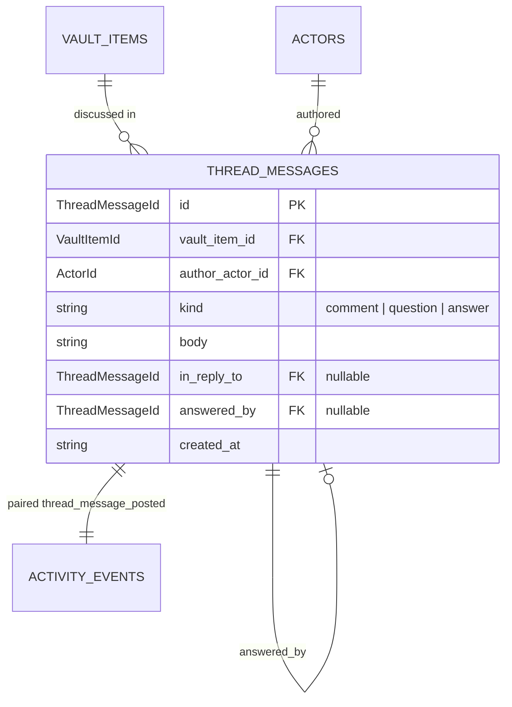

# Thread

> Conversation about a vault item. Distinct from activity events.

## What's here

- `thread-message.ts` — the `ThreadMessage` shape + `ThreadMessageKind` union

## Why a separate entity

A vault item carries two parallel streams:

| | Activity log | Thread |
|---|---|---|
| **Purpose** | What *happened* to the ticket | What's being *said* about it |
| **Shape** | Structured discriminated union | Free-form prose + question-answer threading |
| **Mutation** | Append-only facts, immutable | Messages immutable; questions resolve by getting a linked answer |
| **Example** | `@marvin reassigned (→ @ralph) — "tighten the AC"` | `@jimbo: "what counts as 'qualifying' for Hitchin venues?"` |
| **Who writes** | System (events emitted by commands) | Humans + agents (conversationally) |
| **Unblocks** | Readiness computation, stream views | Nothing on its own — but open questions block dispatch |

Conflating them lost the distinction. The previous `note_added` activity type mixed a conversational message body into a structural event, making activity queries muddy and blocking the system from reasoning about open questions.

## The shape

| field | type | purpose |
|---|---|---|
| `id` | `ThreadMessageId` (UUID) | durable handle |
| `vault_item_id` | `VaultItemId` (FK) | which item this message is about |
| `author_actor_id` | `ActorId` (FK) | who wrote it (human or agent) |
| `kind` | `'comment' \| 'question' \| 'answer'` | semantic role |
| `body` | `string` | the content |
| `in_reply_to` | `ThreadMessageId \| null` | optional parent — set on `answer` to point at its `question` |
| `answered_by` | `ThreadMessageId \| null` | on `question`: id of resolving `answer`, or null while open |
| `created_at` | ISO | — |

No `updated_at`. Messages are immutable. Corrections post a new message; audit via events (P6).

## How it bridges to activity

Every message post produces a `thread_message_posted` activity event. The event carries a pointer (`message_id`) and the denormalised `message_kind` for scannable timelines. The event does NOT carry the body — content lives only in the message row, so the body is edited in one place and there's no drift.

```
post question → writes 1 ThreadMessage + 1 ActivityEvent(thread_message_posted)
mark answered → writes 1 ThreadMessage (the answer) + 1 ActivityEvent
              → updates the original question's answered_by  (this is a mutation,
                so technically also produces a `question_resolved` event — but
                the presence of the answer is the source of truth either way)
```

## Relationships



## Why open questions block dispatch

The intake-quality gatekeeper skill produces clarifying questions when a vault item's body is too sparse for agents to act on. Until those questions are answered, dispatch can't proceed — the agent has no context to work with.

Readiness gets a new conditional check: **"No open questions"**. It only fires when the item has questions; items that never had questions asked don't see it.

```ts
const open = messages.filter(m => m.kind === 'question' && !m.answered_by);
// if open.length > 0, add a failing check to readiness
```

## What's NOT here (deferred)

- **Mentions (`@actor`)** — free-form `@slug` in body is fine for now. Parsing into structured mentions is future work when routing on mentions matters.
- **Reactions / likes** — no use case for a solo operator.
- **Message editing** — immutable by design. Edit = new message.
- **Attachments** — not yet. Link via URL in body if needed.
- **Nested threading beyond depth=1** — `in_reply_to` allows a tree, but UI currently renders flat with single-level threading for answers. Deeper nesting when a real case demands it.
