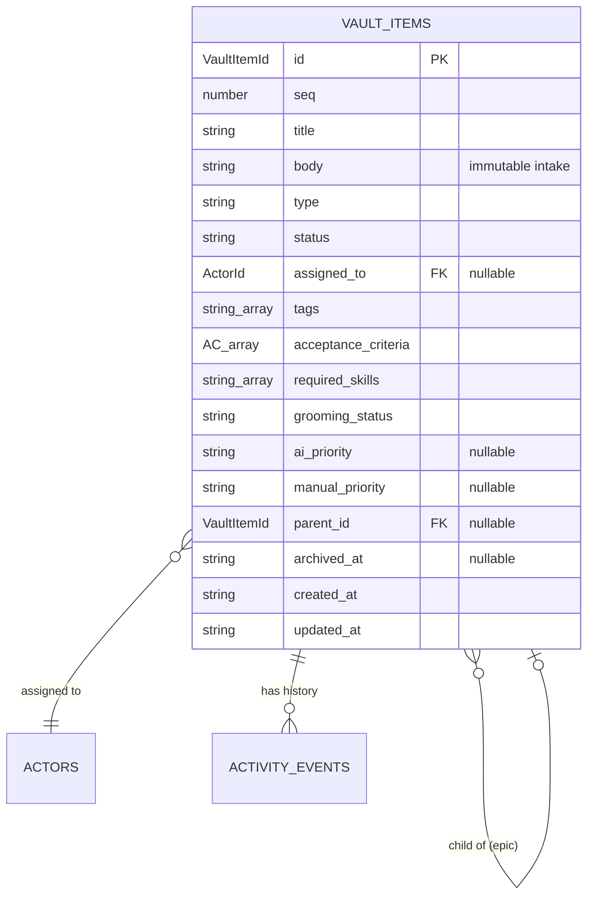

# Vault

> The thing being passed around the pipeline.

## What's here

- `vault-item.ts` — the `VaultItem` shape
- `readiness.ts` — pure projection: `computeReadiness(item)`, `effectivePriority(item)`, `isEpic(childCount)`

## State vs derived — the core split

A `VaultItem` row stores **only** the fields that can't be reconstructed from other state. Everything else is a *projection* — a function call away, never stored. This is the single most important discipline here.

| Stored on `VaultItem` | Derived (not stored) |
|---|---|
| `id`, `seq`, `title`, `body`, `type`, `status` | `readiness` — function of AC, skills, assignee, priority, grooming |
| `assigned_to`, `tags`, `acceptance_criteria`, `required_skills` | `effective_priority` = `manual_priority ?? ai_priority` |
| `grooming_status`, `ai_priority`, `manual_priority` | `is_epic` = `children.length > 0` |
| `parent_id`, `archived_at`, `created_at`, `updated_at` | `last_activity_at` = latest `activity_events.at` |

If the same fact exists twice — once as stored state, once as derived — they will drift. So derived facts live in functions, computed on read.

## The fields

| field | type | why it's here |
|---|---|---|
| `id` | `VaultItemId` (UUID) | FK target; machine identity |
| `seq` | `number` | operator-facing handle (`#2417`) — shorter to say than a UUID |
| `title` | `string` | the line that appears in lists |
| `body` | `string` | intake — treated as immutable in the UI. Acceptance criteria are the processed output; body is the source |
| `type` | `'task' \| 'bookmark' \| 'note'` | coarse classifier, drives which UI shows it |
| `status` | `'active' \| 'done' \| 'archived'` | lifecycle — not workflow (workflow is `grooming_status`) |
| `assigned_to` | `ActorId \| null` | current owner; null = unclaimed |
| `tags` | `string[]` | free-form labels; denormalised on purpose |
| `acceptance_criteria` | `AcceptanceCriterion[]` | `{text, done}[]` — the refined definition of done |
| `required_skills` | `string[]` | slug array for now; upgrades to junction once skills are first-class (whiteboard row 5) |
| `grooming_status` | enum | where the item is in the readiness workflow — single column; transitions audited via `activity_events` |
| `ai_priority` | `Priority \| null` | AI-suggested P0–P3 |
| `manual_priority` | `Priority \| null` | operator override; `effective = manual ?? ai` |
| `parent_id` | `VaultItemId \| null` | epic hierarchy edge. `is_epic` is derived from children count, not stored |
| `archived_at` | `string \| null` | soft-delete timestamp; `status = 'archived'` + `archived_at IS NOT NULL` are kept in sync |
| `created_at` | ISO string | |
| `updated_at` | ISO string | |

## What's explicitly NOT here

See [`docs/architecture/whiteboard.md`](../../../../docs/architecture/whiteboard.md) for revisit triggers. In summary:

- **`executor`** (killed K4) — two ownership fields (`assigned_to` + `executor`) was confusing; "auto" is default, override by reassigning.
- **Thread / messages** (row 12) — `note_added` activity events are the comment primitive for MVP.
- **Full 5-state grooming transitions in a dedicated audit table** — activity events carry the history; dedicated `grooming_audit` only if that becomes insufficient.
- **`is_epic` as a stored field** — derived from children count.
- **Readiness as a stored field** — purely computed; see `readiness.ts`.
- **Projects, priorities-as-entities, dispatch queue, benchmarks** — whiteboard rows 14–26.

## Relationships

